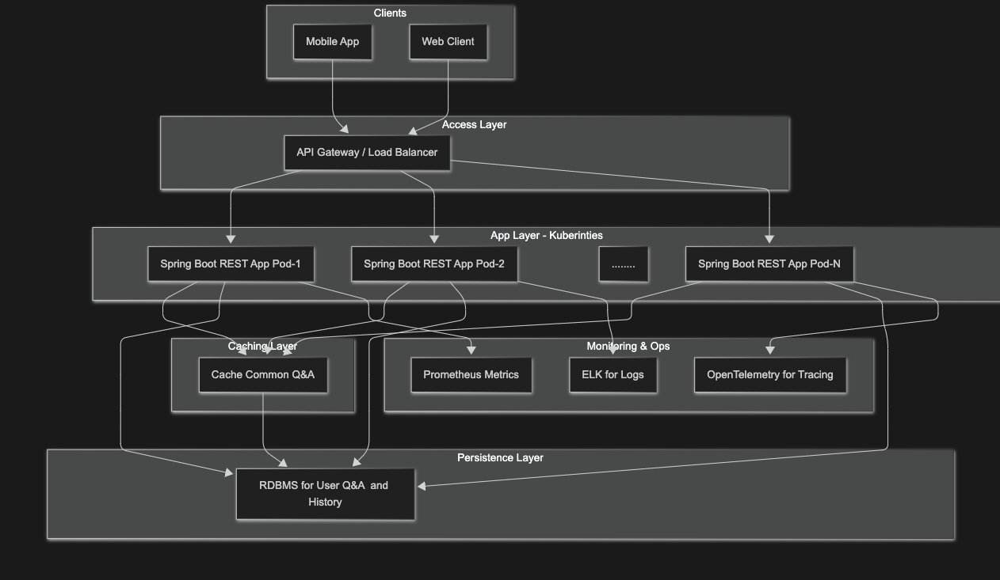

# RoboBob REST API System Design

This document outlines the high-level system design and deployment architecture for scaling the RoboBob application as a REST API to handle real-world traffic, user history, and ensure high availability.

---

## ✅ Objectives

Design a scalable, fault-tolerant, and observable system that supports:
- 100 queries per second (QPS) from concurrent users.
- Persistent storage of user-specific question history.
- Elastic scaling to support dynamic traffic.
- REST API endpoints for asking questions and retrieving user history.

---

## 🧱 Architecture Diagram

---

## 🧩 Component Breakdown

### 🔹 API Gateway / Load Balancer
- Routes traffic to backend pods.
- Enables throttling, routing, and SSL termination.

### 🔹 Spring Boot REST API (Stateless)
- `/ask` — Ask a question
- `/history` — Fetch user-specific Q&A history
- Stateless pods (scalable via K8s or ECS)

### 🔹 Cache (Redis Cache)
- Speeds up access for frequently asked questions

### 🔹 PostgreSQL / Aurora RDS
- Primary storage of user, Q&A, history, logs

### 🔹 Monitoring
- **Prometheus** for metrics
- **ELK** for logs
- **OpenTelemetry** for tracing distributed requests

---

## 🚀 Deployment Strategy

| Layer          | Tooling                  |
|----------------|---------------------------|
| Containerization | Docker + Spring Boot      |
| Orchestration  | Kubernetes / ECS Fargate   |
| CI/CD          | GitHub Actions / Jenkins   |
| Observability  | Grafana + Prometheus stack |

---

## 📜 Assumptions

- JWT/OAuth2-based user authentication assumed.
- Questions history grows linearly; needs archiving later.
- Rate limiting and retries to handle burst traffic.

---

## 🧪 Future Considerations

- LLM-powered answer fallback
- Multilingual question matching (i18n)
